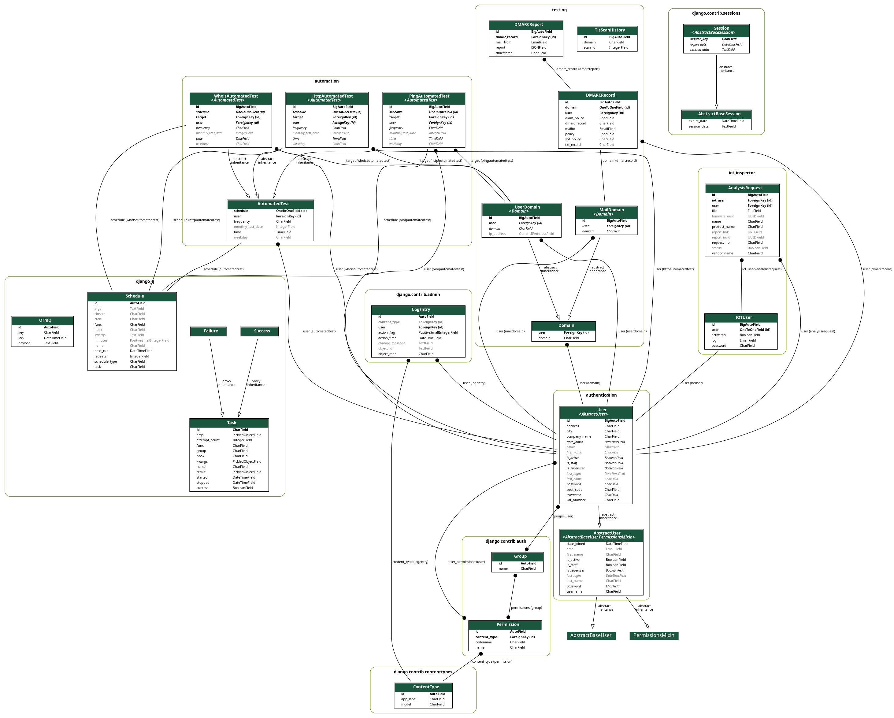
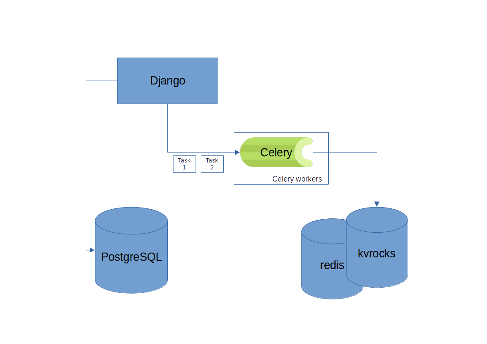

Architecture
============

Models
------

   Business related models.

High level architecture
-----------------------

   High level architecture.

Kvrocks
-------

Format of the data

.. code-block:: json

    {
        "version": "1",
        "format": "scanning",
        "meta": {
            "uuid": "<UUID>",
            "ts": "date",
            "type": "nmap-scan",
            "",
        },
        "payload": {
            "row": "<base64-encoded-string>"
        }
    }
